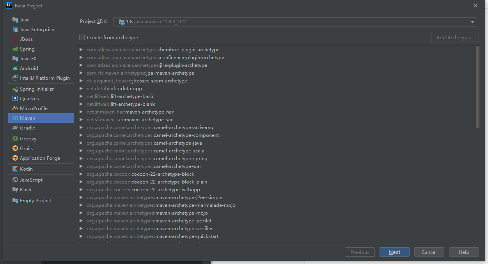
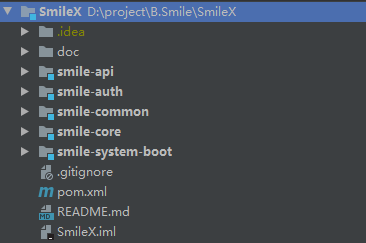

[toc]

---


# 创建项目（多模块）



创建项目后，删除项目下的src。再一次创建maven模块


我这里将项目分成了以下5个模块创建：

- api。用于存放service、entity和dao
- auth。用于存放身份验证和授权代码，方便后面独立扩展网关
- common。用于存放一下通用库和配置
- system-boot。用于存放单机springboot的启动类及controller层
- core。用于存放一些核心配置和工具

现在目录结构如下：




# Maven管理

## 继承父POM

在外层目录下的Pom中指定springboot版本，因为模块的POM都是继承了外层的POM。后续的版本管理和一些通用以来依赖放在外层的POM中。

```xml
<parent>
    <groupId>org.springframework.boot</groupId>
    <artifactId>spring-boot-starter-parent</artifactId>
    <version>2.3.5.RELEASE</version>
</parent>
```

这里使用parent继承了spring-boot-starter-parent的作用，可以查看[博客文章](https://blog.csdn.net/dubismile/article/details/121428181)


## 仓库

这里指定使用了aliyun的Maven仓库，后续如果是需要使用nexus自建maven仓库，存放自己的一些开发库并对库进行管理，需要在pom这里添加自己的maven仓库的信息。

```xml
<repositories>
    <repository>
        <id>aliyun</id>
        <name>aliyun Repository</name>
        <url>https://maven.aliyun.com/repository/public</url>
        <snapshots>
            <enabled>false</enabled>
        </snapshots>
    </repository>
</repositories>
```
