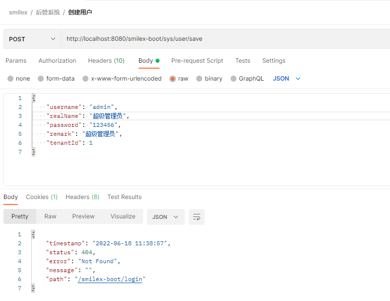
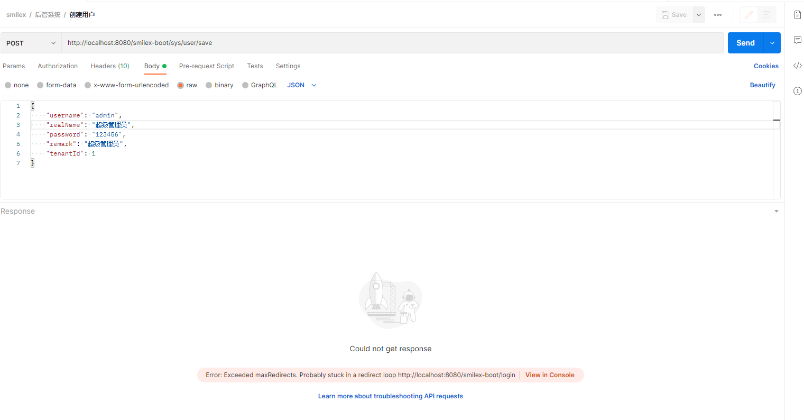
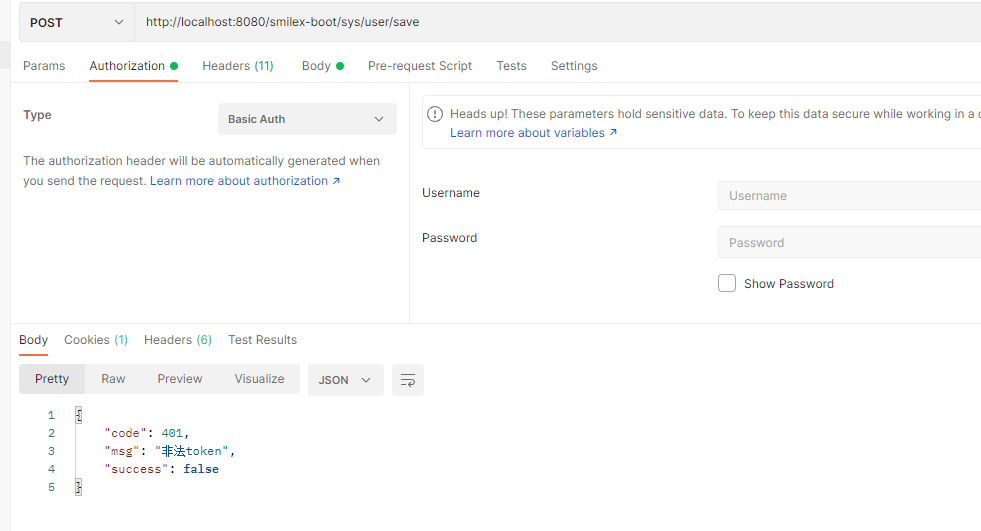

[toc]

---

# 前言


# 问题记录

## Springboot+Shiro，使用postman会显示404，需要返回未授权响应(JSON格式)

### 问题描述

今天当我配置完springboot+shiro后，我用postman返回任何接口都会返回404。

结果显示：



配置信息：


```java

    @Bean(name = "filterShiroFilterRegistrationBean")
    public ShiroFilterFactoryBean shiroFilterFactoryBean(DefaultWebSecurityManager securityManager,ShiroFilterChainDefinition shiroFilterChainDefinition) {

        ShiroFilterFactoryBean shiroFilterFactoryBean = new ShiroFilterFactoryBean();
        shiroFilterFactoryBean.setSecurityManager(securityManager);
        				shiroFilterFactoryBean.setFilterChainDefinitionMap(shiroFilterChainDefinition.getFilterChainMap());
        return shiroFilterFactoryBean;
    }
@Bean
public ShiroFilterChainDefinition shiroFilterChainDefinition() {
    DefaultShiroFilterChainDefinition chainDefinition = new DefaultShiroFilterChainDefinition();
    chainDefinition.addPathDefinition("/sys/login", "anon");
    chainDefinition.addPathDefinition("/**", "authc");
    return chainDefinition;
}
```

很奇怪没有明白为什么会显示404，然后就去查找了官方的问题，发现在使用 authc 拦截时，如果没有通过验证，那么会重定向到 LoginUrl，可是我这里只想返回401无权限访问。

这里插一句题外话，如果把 shiroFilterFactoryBean 的beanName换成 shiroFilterFactoryBean，如下代码所示：

```java
@Bean(name = "shiroFilterFactoryBean")
public ShiroFilterFactoryBean shiroFilterFactoryBean(DefaultWebSecurityManager securityManager,ShiroFilterChainDefinition shiroFilterChainDefinition) {

    ShiroFilterFactoryBean shiroFilterFactoryBean = new ShiroFilterFactoryBean();
    shiroFilterFactoryBean.setSecurityManager(securityManager);
    shiroFilterFactoryBean.setFilterChainDefinitionMap(shiroFilterChainDefinition.getFilterChainMap());
    return shiroFilterFactoryBean;
}
```

那么这里的异常界面就会显示为：提示重定向次数过多。



###  定位原因

那么如何解决这个重定向 LoginUrl 问题呢？其实我们可以在官方文档[默认过滤器](https://shiro.apache.org/web.html#default_filters)找到答案。

我们看一下过滤器 authc 对应的过滤器  [org.apache.shiro.web.filter.authc.FormAuthenticationFilter](https://shiro.apache.org/static/current/apidocs/org/apache/shiro/web/filter/authc/FormAuthenticationFilter.html) 的源码。

```java
// 继承了 AuthenticatingFilter 认证过滤器
public class FormAuthenticationFilter extends AuthenticatingFilter {
    
    // 无权限
    protected boolean onAccessDenied(ServletRequest request, ServletResponse response) throws Exception {
        if (this.isLoginRequest(request, response)) {
            if (this.isLoginSubmission(request, response)) {
                if (log.isTraceEnabled()) {
                    log.trace("Login submission detected.  Attempting to execute login.");
                }

                return this.executeLogin(request, response);
            } else {
                if (log.isTraceEnabled()) {
                    log.trace("Login page view.");
                }

                return true;
            }
        } else {
            if (log.isTraceEnabled()) {
                log.trace("Attempting to access a path which requires authentication.  Forwarding to the Authentication url [" + this.getLoginUrl() + "]");
            }

            this.saveRequestAndRedirectToLogin(request, response);
            return false;
        }
    }
    
    //保存请求并重定向到登录页面
     protected void saveRequestAndRedirectToLogin(ServletRequest request, ServletResponse response) throws IOException {
        saveRequest(request);
        redirectToLogin(request, response);
    }
    
    // 跳转登录页面
    protected void redirectToLogin(ServletRequest request, ServletResponse response) throws IOException {
        String loginUrl = getLoginUrl();
        WebUtils.issueRedirect(request, response, loginUrl);
    }

}
```

这里提取了部分源码，可以看出当用户无权限访问路径时，authc过滤器会将我们的请求重定向到 loginUrl，我们可以在shiroFilterFactoryBean里面配置它。这样就可以跳转到对应的路径了。

```java
shiroFilterFactoryBean.setLoginUrl("/login");
```

既然我们知道了使用 authc 过滤器时，无权限会发生跳转的原因，那么我们应该如何实现返回JSON呢？

### 解决方案

我们可以自定义拦截器继承 AuthenticatingFilter 类。

```java
public class ShiroFilter extends AuthenticatingFilter {

    @Override
    protected boolean onAccessDenied(ServletRequest request, ServletResponse response) throws Exception {
        //获取请求token，如果token不存在，直接返回401
        HttpServletRequest httpServletRequest = (HttpServletRequest) request;
        HttpServletResponse httpServletResponse = (HttpServletResponse) response;
        String token = getRequestToken(httpServletRequest);
        if (StringUtils.isBlank(token)) {
            String json = "{\"code\":401,\"msg\":\"非法token\",\"success\":false}";
            httpServletResponse.getWriter().print(json);
            return false;
        }
        return executeLogin(request, response);
    }

    /**
     * 获取请求的token
     */
    private String getRequestToken(HttpServletRequest httpRequest) {
        //从header中获取token
        String token = httpRequest.getHeader(CommonConstant.S_ACCESS_TOKEN);

        //如果header中不存在token，则从参数中获取token
        if (StringUtils.isBlank(token)) {
            token = httpRequest.getParameter(CommonConstant.S_ACCESS_TOKEN);
        }

        return token;
    }


    @Override
    protected AuthenticationToken createToken(ServletRequest request, ServletResponse response) {
        //获取请求token
        String token = getRequestToken((HttpServletRequest) request);

        if (StringUtils.isBlank(token)) {
            return null;
        }

        return new OAuth2Token(token);
    }
}
```

 通过重新重写 onAccessDenied 方法，我们就能实现当验证失败时返回json的功能，告知用户无权限操作。这里还需要把过滤器加载到 ShiroFilterFactoryBean 中。

```java

@Bean(name = "shiroFilterFactoryBean")
public ShiroFilterFactoryBean shiroFilterFactoryBean(DefaultWebSecurityManager securityManager,ShiroFilterChainDefinition shiroFilterChainDefinition) {

    ShiroFilterFactoryBean shiroFilterFactoryBean = new ShiroFilterFactoryBean();

    // 这里将过滤器类添加进去，名称为 myAuthc 
    Map<String, Filter> filters = new HashMap<>();
    filters.put("myAuthc", new ShiroFilter());
    shiroFilterFactoryBean.setFilters(filters);
    shiroFilterFactoryBean.setSecurityManager(securityManager);
    shiroFilterFactoryBean.setFilterChainDefinitionMap(shiroFilterChainDefinition.getFilterChainMap());

    return shiroFilterFactoryBean;
}

@Bean
public ShiroFilterChainDefinition shiroFilterChainDefinition() {
    DefaultShiroFilterChainDefinition chainDefinition = new DefaultShiroFilterChainDefinition();
    chainDefinition.addPathDefinition("/sys/login", "anon");
    // 将所有的都使用 myAuthc拦截
    chainDefinition.addPathDefinition("/**", "myAuthc");
    return chainDefinition;
}

```

让我们看一下效果。



### 总结

其实当我们使用authc过滤器，出现404的现象是正常的，因为授权失败了后会自动跳转登陆页面，那我们没有配置这个登陆页面时，就会出现404。所以我们可以通过自定义过滤器并使用的方式，从而返回JSON或者其它自己所需要的授权失败结果。