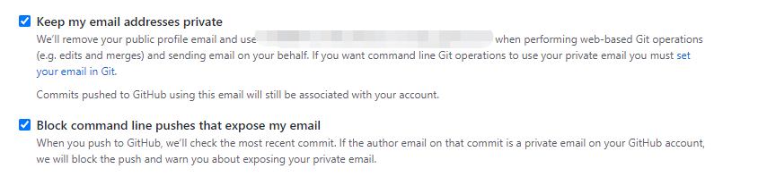

[toc]

---

# github 开启隐私邮箱

1. 开启隐私邮箱。



2. 执行推送 git push，出现异常

```shell
remote: error: GH007: Your push would publish a private email address.        
remote: You can make your email public or disable this protection by visiting:        
remote: http://github.com/settings/emails        
error: failed to push some refs to 'git@github.com:xxx/xxx.git'
```

3. 查询本地配置

```shell
git config --global --list

# 输出结果
#user.name=smile
#user.email=xxx@qq.com
```

4. 更改全局邮箱配置

```shell
git config --global user.email "xxxx-xxxx@users.noreply.github.com"
```

5. **重置上次提交的作者信息 (关键)**

```shell
git commit --amend --reset-author

# 输入命令后，会进入vi模式，直接在英文输入法下:wq(冒号wq)保存即可
```

6. 再次推送即可。