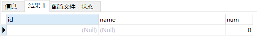
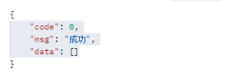

[toc]


---


# 关于使用Left join 和 count时，无数据时，list 返回时出现一条空数据

1. 创建msyql数据表

```mysql
create table `tb_group`(
    id bigint(20) unsigned not null AUTO_INCREMENT,
    `name` varchar(255) CHARACTER set utf8mb4 COLLATE utf8mb4_bin DEfault Null comment "组名称",
    primary key (`id`) using btree
)ENGINE=Innodb CHARSET=utf8mb4 COMMENT="分组表";


create table `tb_detail`(
    id bigint(20) unsigned not null AUTO_INCREMENT,
		group_id bigint(20) unsigned not null,
    `name` varchar(255) CHARACTER set utf8mb4 COLLATE utf8mb4_bin DEfault Null comment "明细名称",
    primary key (`id`) using btree
)ENGINE=Innodb CHARSET=utf8mb4 COMMENT="明细表";
```

2. 插入数据

```mysql
INSERT INTO `tb_group` (`id`, `name`) VALUES (1, '1');
INSERT INTO `tb_group` (`id`, `name`) VALUES (2, '2');
INSERT INTO `tb_detail` (`id`, `group_id`, `name`) VALUES (1, 1, '1-1');
INSERT INTO `tb_detail` (`id`, `group_id`, `name`) VALUES (2, 1, '1-2');
INSERT INTO `tb_detail` (`id`, `group_id`, `name`) VALUES (3, 2, '1-2');
```

3. 实体类

```java
/**
 * 组实体类
 */
@Data
public class TbGroup{
    private Long id;
    private String name;
}
/**
 * 明细实体类
 */
@Data
public class TbDetail{
    private Long id;
    private Long groupId;
    private String name;
}
/**
 * 组统计实体类
 */
@Data
public class TbGroupAndDetailCountVo{
    private Long id;
    private String name;
    private Integer count;
}
```

4. 编写mapper.xml

```xml
<select id="selectGroupAndDetailCount" result="TbGroupAndDetailCountVo">
	select 
    	tb_group.id,
    	tb_group.name,
    	count(1) `count`
    from 
    	tb_group left join tb_detail on tb_group.id = tb_detail.group_id
    where tb_group.id =3 
</select>
```

5. 编写mapper.dao

```java
List<TbGroupAndDetailCountVo> selectGroupAndDetailCount()
```

6. 我们将下面的sql在mysql里面直接执行，都会看见同样的输出结果。



7. 那通过mybatis映射后呢？


可以看见会有一条空数据count 0 。那么如何解决这个问题呢？

只需要在sql里面增加一句 group by tb_group.id即可。

```mysql
select 
    	tb_group.id,
    	tb_group.name,
    	count(1) `count`
    from 
    	tb_group left join tb_detail on tb_group.id = tb_detail.group_id
    where tb_group.id =3 
    group by tb_group.id
```

